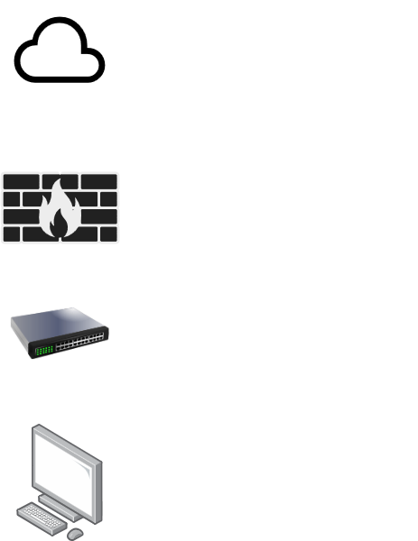

# 🛡️ Firewall & Network Security Lab with pfSense and Lubuntu

This repository contains the documentation, diagram, and configuration files for a hands-on network and cybersecurity lab, created using **pfSense** and **Lubuntu** on **VirtualBox**.

---

## Network Topology

### Asset Description:

1. **Firewall / Router (pfSense v2.7+):**
   * **WAN Interface (Adapter 1):** Bridged Mode (Connected to the physical network/internet).
   * **LAN Interface (Adapter 2):** Internal Network Mode (`intnet`) - Subnet `192.168.1.0/24`.
   * **Active Services:** DHCP Server, NAT, Packet Filtering Rules.

2. **Client Workstation (Lubuntu Linux):**
   * **LAN Interface (Adapter 1):** Internal Network Mode (`intnet`).
   * **IP Assignment:** Assigned via DHCP by pfSense (e.g., `192.168.1.100`).

---

## Implemented Features

* [x] **Network Segmentation:** Physical/virtual separation between the WAN (external) and LAN (internal).
* [x] **DHCP Server:** Configured on the LAN interface for automatic IP allocation.
* [x] **Firewall Rules (Stateful Filtering):** Custom rules for allowing and denying traffic.
* [x] **NAT (Network Address Translation):** Mapping for outbound packets from the LAN to the WAN. ---

## Test Report and Evidence

To view the executed test scenarios (ping tests, port blocking, and traffic validation with screenshots), access the full document at:
 **[Executed Test Report](docs/test-report.md)**

---

##  How to Replicate This Environment

1. Download the pfSense and Lubuntu ISOs.
2. In VirtualBox, create an internal network named `intnet`.
3. Import the pre-defined pfSense settings using the file available in this folder: `configs/pfsense-backup.xml`.
